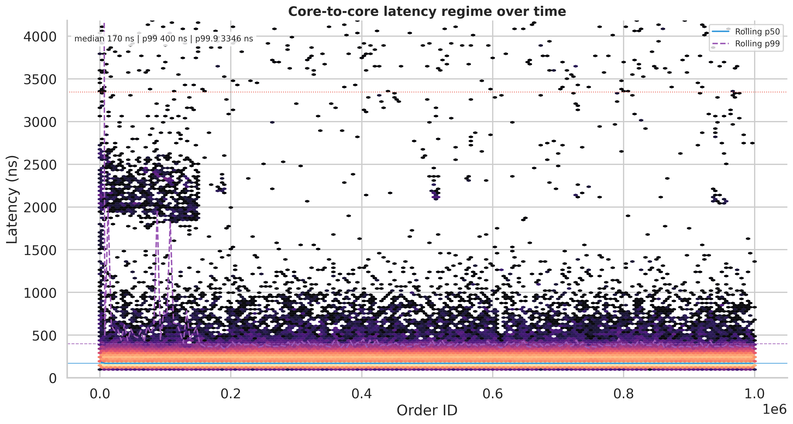
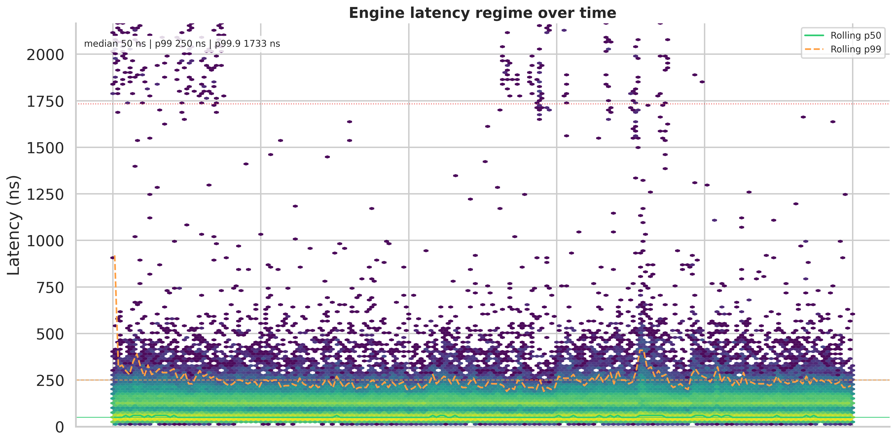
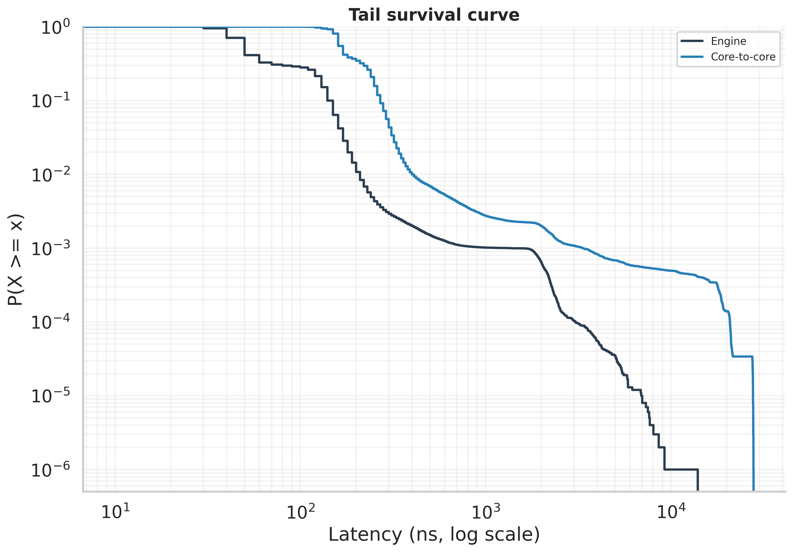
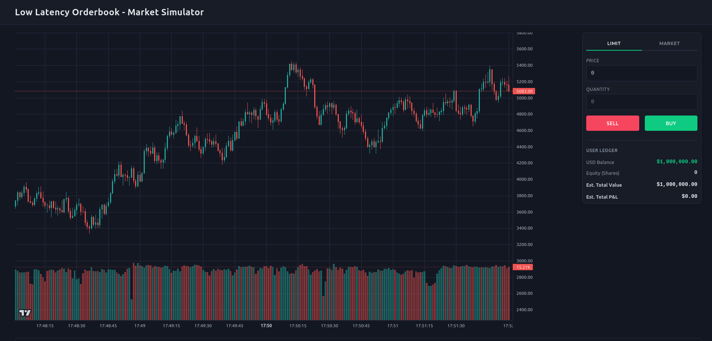
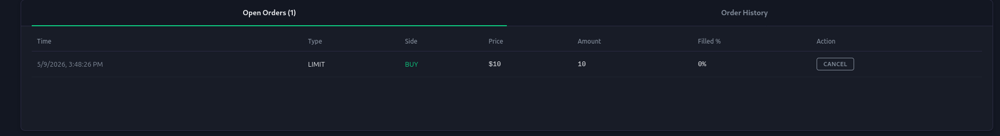
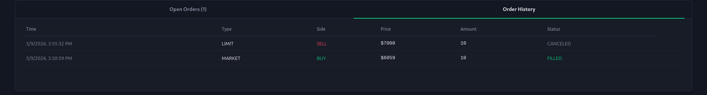
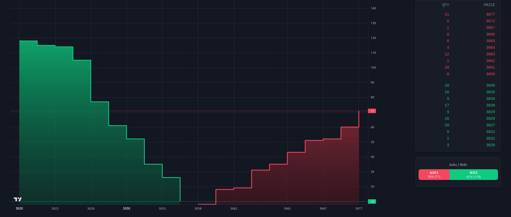
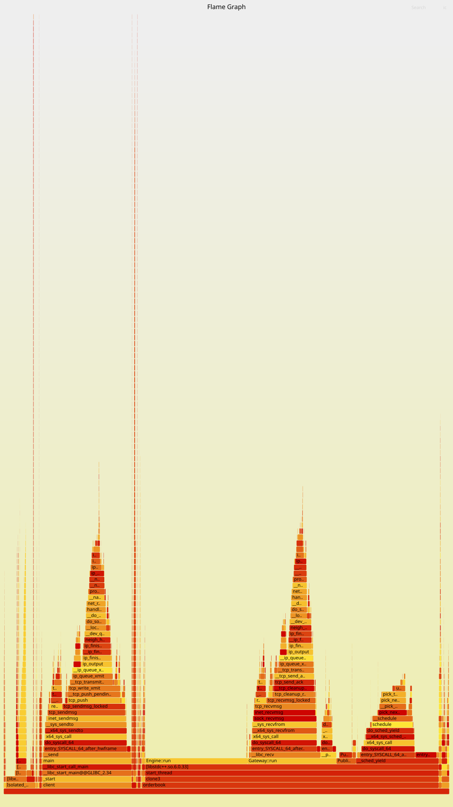

# Low-Latency Spot Market Matching Engine & Trading Terminal


A high-performance, multi-threaded spot market matching engine and trading terminal. Built to explore the limits of C++20 in high-frequency trading contexts, this system utilizes custom memory allocators, lock-free concurrency, and strict cache-line management to achieve matching latencies under 100ns. It is paired with a React frontend for real-time orderbook visualization.

---

## System Architecture

The platform is decoupled into three distinct layers to ensure the matching hot-path remains completely isolated from I/O overhead:

### 1. The Core Matching Engine (C++20)
- **Zero-Allocation Hot Path:** Completely bypasses the OS memory manager (`malloc`/`new`) during execution using pre-allocated, contiguous memory pools (`OrdersPool`).
- **Lock-Free Concurrency:** Inter-thread communication is handled exclusively via lock-free Single-Producer-Single-Consumer (SPSC) ring buffers (`RingBuffer`).
- **Cache Optimization:** Data structures are explicitly aligned and padded to 64-byte boundaries to eliminate false sharing and minimize L3 cache misses.
- **Integer-Based Ledger:** Floating-point arithmetic is entirely removed. The engine relies on a zero-latency ledger using `uint64_t`/`int64_t` for high-frequency price and volume calculations.

### 2. The Broadcaster Bridge (C++ to Python)
- **C++ Publisher Thread:** A dedicated consumer thread reads state updates (Orderbook Snapshots, EXECUTED/CANCELED trades) from the ring buffer and blasts them via UDP Multicast, preventing socket I/O from blocking the matching thread.
- **Python Websocket Bridge:** A lightweight `trades_viewer.py` feed handler listens to the multicast stream, aggregates ticks, and broadcasts to the frontend via WebSockets.

### 3. The Frontend Terminal (React 18 / Vite)
- **Real-Time DOM:** A depth-of-market (DOM) rendering at 60 FPS.
- **Reactive State:** Live, dynamically calculated P&L and estimated balances with zero-perceived-latency UI updates.

---

## Performance & Microbenchmarks

The engine has been aggressively profiled to measure both the isolated matching logic (Engine Latency) and the full journey from order ingress to the publisher thread (Core-to-Core Latency).

*Note: Benchmarks conducted on hardware describred below, using a sample size of 10,000,000 orders. Visualizations represent a chronologically consistent sample of 1,000,000 orders to ensure visual clarity.*

### Latency Profiles (10,000,000 Orders)

| Metric | Engine Latency (Matching Only) | Core-to-Core Latency (End-to-End) |
| :--- | :--- | :--- |
| **Median (50th Pct)** | **50 ns** | **170 ns** |
| **99th Percentile** | 210 ns | 370 ns |
| **99.9th Percentile** | 430 ns | 1,352 ns |

*Note: Throughput scales to **~10,000,000 ops/sec** when batched, and ~200,000 ops/sec during unbatched, single-order dispatches.*

### Benchmark Visualizations






*This CDF plot demonstrates the latency budget gap and highlights the flattening of the tail, proving the effectiveness of the lock-free architecture under heavy load.*

### Hardware & Environment
* **CPU:** AMD Ryzen 5 7535HS 3.30GHz
* **OS:** Ubuntu 22.04 LTS
* **Compiler:** GCC 13.3.0 with `-O3 -march=native -Wall -Wextra -pthread`
* **Tuning:** CPU threads pinned via `isolcpus`

---

## Visuals

### Trading Terminal UI
*Live dark-mode terminal with L2 orderbook, charting, and reactive P&L executions.*






### CPU Flamegraph & Profiling
*Analyzing the hot-path zero-allocation engine efficiency.*



---

## Build & Run Instructions

### Prerequisites
- **C++ Backend:** CMake 3.10+, GCC/Clang with C++20 support.
- **Python Bridge:** Python 3.8+
- **React Frontend:** Node.js 18+ and `npm`.

### Quick Start (Using `run.sh`)
Bootstrap the entire environment (Engine, Broadcaster, and React GUI):
```bash
chmod +x run.sh
./run.sh
```
### Manual Execution
1. Build & Run the Backend Engine:
```bash
mkdir -p build && cd build
cmake .. -DCMAKE_BUILD_TYPE=Release
make -j$(nproc)
./orderbook
```

2. Start the Python WebSocket Bridge (Broadcaster):
```bash
python3 apps/trades_viewer.py
```

3. Launch the React Frontend :
```bash
cd frontend
npm install
npm run dev
# Open http://localhost:5173
```

4. Blast Orders (Benchmark Client):
```bash
# Push 1,000,000 orders
./build/client
```

## Immediate Roadmap & Next Steps
- **Kernel Bypass Networking:** Transition from standard TCP sockets to DPDK or Solarflare EFVI to eliminate kernel network stack overhead on order ingress.
- **NUMA Awareness**: Refactor memory allocations to ensure the `OrdersPool` and matching threads strictly reside on the same NUMA node.
- **Hugepages**: Implement `mmap` with `MAP_HUGETLB` (2MB/1GB pages) to minimize TLB misses during high-throughput bursts.